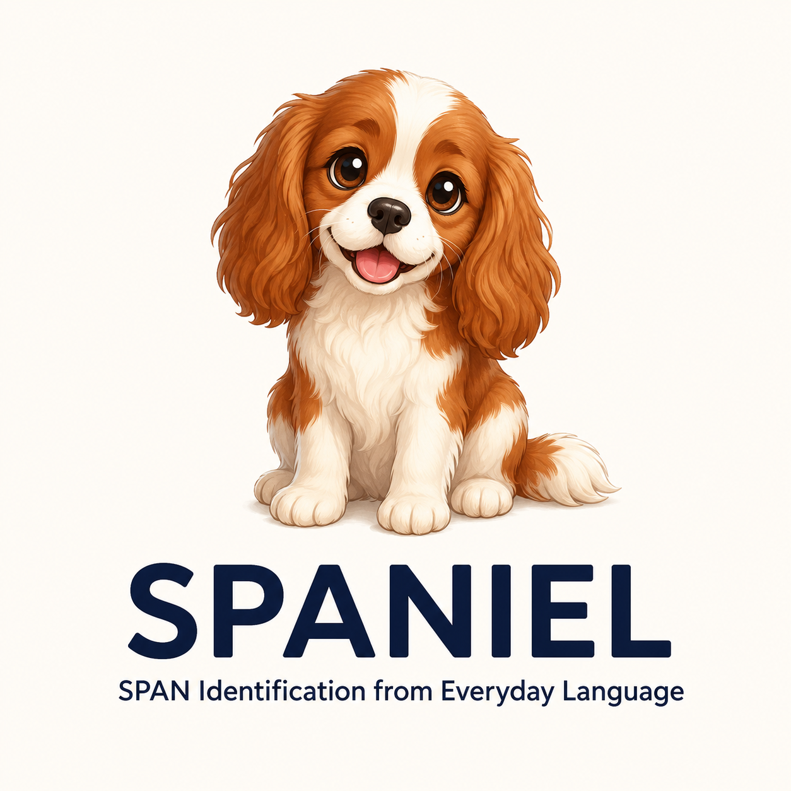
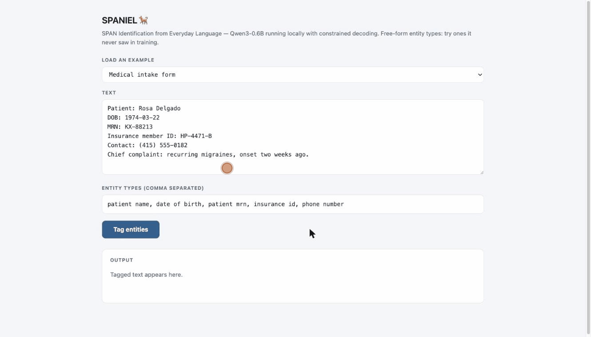

<p align="center">
  
</p>

<h1 align="center">SPANIEL</h1>

<p align="center">
  <strong>SPAN Identification from Everyday Language</strong><br>
  <em>A small retriever that fetches any span you name.</em>
</p>

<p align="center">
  <a href="https://huggingface.co/Harsh/qwen3-0.6b-pii-sft-v2">Model</a> ·
  <a href="#try-it-the-demo-app">Demo</a> ·
  <a href="#results">Results</a> ·
  <a href="#the-journey-as-blog-entries">Blog series</a>
</p>

---

SPANIEL is a 0.6B-parameter PII extraction model that accepts **free-form
entity type names**, runs entirely on your own hardware, and is structurally
incapable of altering the text it annotates.

Give it a document and a list of types — including types it has never seen,
like `patient mrn` or `severance amount` — and it returns the document
byte-identical, with matching spans wrapped in XML tags:

```text
Entity types:
- person name
- patient mrn

Text:
Patient Brian Weaver (MRN BX-40912) called about his appointment...
```

```text
Patient <person name>Brian Weaver</person name> (MRN <patient mrn>BX-40912</patient mrn>) called about his appointment...
```

<p align="center">
  
</p>

## Why this exists

Two reasons, one personal and one technical.

The personal one: [Harsh Singhal](https://www.linkedin.com/in/harshsinghal/)
wanted to scratch a long-standing itch — build a serious NER system on a
*small* language model, end to end: data curation, fine-tuning, evaluation
design, decoding, and serving, with every decision made deliberately rather
than inherited. SPANIEL is that itch, scratched in public. The
[journal entries](#the-journey-as-blog-entries) document every experiment,
including the failures.

The technical one: [GLiNER](https://github.com/urchade/GLiNER) showed that
open-type NER — *name any entity type at inference* — is possible with a
compact model, and it remains the accuracy-per-millisecond benchmark for
fixed-schema extraction. SPANIEL is inspired by that idea but takes the
generative route to chase two properties an encoder can't offer: **tagged
full-text output** (grounded, diffable, redaction-ready — with a constrained
decoder making copy drift mathematically impossible), and a recipe that
**rides the small-LLM ecosystem** — every year's better 0.6B base model is a
one-line upgrade. The bet, now measured: a $2.50 fine-tune of a 0.6B model
beats a 120B model prompted zero-shot by 35 F1 points on this task.

## Try it: the demo app

One command, local-only — no data leaves your machine:

```bash
docker run -p 8377:8377 -v spaniel-models:/models ghcr.io/harshsinghal/spaniel
# open http://localhost:8377
```

- The model (~1.2 GB) is pulled from the Hugging Face hub on first start and
  cached in the named volume.
- On Linux with an NVIDIA GPU, add `--gpus all`. On Mac/Windows it runs on
  CPU (a demo paragraph takes ~10–30 s — the price of local-only).
- The UI ships with **15 preloaded examples** — medical forms, server logs,
  transcripts, invoices, and an encyclopedic-prose case that demonstrates the
  attribute-semantics stance — each with editable free-form entity types.
- Every response is generated under the constrained decoder: the
  **copy-faithful ✓** badge is a guarantee, not a check.

<details>
<summary><strong>Running from source instead</strong></summary>

```bash
cd pii_tagger
python -m venv .venv
.venv/bin/pip install torch transformers fastapi uvicorn huggingface_hub
PII_MODEL_ID=Harsh/qwen3-0.6b-pii-sft-v2 \
  .venv/bin/python -m uvicorn server:app --app-dir . --port 8377
```

</details>

## Results

Strict span-level exact-match F1 · 300-document held-out eval · constrained decoding.

| Model | Trained names | Adjudicated gold | Unseen names |
|:--|:-:|:-:|:-:|
| gpt-oss-120b, zero-shot | 0.580 | — | — |
| v1 (0.6B, 273k examples) | 0.944 | 0.924 | 0.747 |
| **v2 (0.6B, 389k, 4 sources)** | 0.930 | 0.918 | **0.864** |

- Copy drift and malformed output under the constrained decoder: **0.0%** —
  not measured low, *grammatically impossible*.
- The three columns are three measuring sticks over one inference procedure:
  the original (noisy) gold, an adjudicated and human-spot-checked gold, and
  requests phrased with entity names absent from all training aliases.
- v2's −1.4 on the first column is by design (it un-learned annotation
  noise); its +11.7 on the last column is the point.

## The journey, as blog entries

| # | Entry | One-line summary |
|:-:|:--|:--|
| 1 | [A $2.50 fine-tune that beats a 120B model](journal/2026-07-08-tagged-regeneration-recipe.md) | The tagged-regeneration format, label conditioning, alias sampling — and 0.6B tying 1.7B. |
| 2 | [What a sushi chain taught our PII model](journal/2026-07-09-attribute-vs-mention-semantics.md) | Attribute vs. mention semantics; the questions a dataset silently answers. With reading list. |
| 3 | [Making drift unrepresentable](journal/2026-07-12-constrained-decoding.md) | The copy-or-tag automaton, the vocabulary trie, and two constrained-decoding bugs that generalize. |
| 4 | [The $10 audit](journal/2026-07-18-ten-dollar-audit.md) | Frontier models in batch mode: gold was 9% wrong, the model had learned the noise, nano models can't judge. |
| 5 | [v2: buying back the generalization gap](journal/2026-07-19-v2-generalization.md) | Four sources, ratified guidelines, +11.7 on unseen entity names. |
| 6 | [Teaching a small model to think — four experiments, two sizes](journal/2026-07-21-thinking-negative-result.md) | Imitation, RL, a 3× bigger model, and a reasoning specialist. Size breaks the 0.6B wall; thinking still doesn't beat direct answering; and a math-reasoning specialist is *worse*, not better — reasoning skill doesn't transfer across domains. |

## Repository layout

| Path | What |
|:--|:--|
| `spans_to_xml.py` | Span → tagged-text conversion (the core representation) |
| `convert_pii_datasets.py` · `convert_ai4privacy.py` | Dataset converters |
| `build_sft_dataset.py` · `build_sft_dataset_v2.py` | Seeded, reproducible training-mixture builders |
| `label_aliases.json` · `label_aliases_v2.json` | Alias sets per label — the generalization mechanism |
| `guidelines_v2.md` | Canonical annotation rules, human-ratified |
| `pii_decode.py` | Constrained decoder: vocabulary trie + copy-or-tag automaton |
| `pii_eval.py` | Span-level scorer (strict/relaxed, per-label, operational failure rates) |
| `error_autopsy.py` | Disagreement classifier (boundary / miss / swap / spurious) |
| `run_constrained_eval.py` · `run_baseline.py` | Evaluation runners |
| `build_batch_jobs.py` | OpenAI batch-mode jobs (adjudication, audit, aliases, synthesis) |
| `pii_tagger/` | The local web app (FastAPI, constrained by default) |
| `vast_run/` | GPU training scripts (TRL SFT, env-configurable) |
| `journal/` | The blog entries above |

Large artifacts (converted datasets, training mixtures, model weights,
predictions) are intentionally not in the repo; every one is reproducible
from the seeded builders or downloadable from the Hugging Face hub.

## Reproducing

```bash
# 1. Convert sources and build the v2 mixture (seeded — byte-identical rebuilds)
python convert_ai4privacy.py --split train --out pii_xml/ai4privacy_en.jsonl
python build_sft_dataset_v2.py --outdir sft_data_v2

# 2. Train (any CUDA box; ~11 h on one H100 NVL)
SFT_MODEL=Qwen/Qwen3-0.6B SFT_BS=16 SFT_ACCUM=2 python vast_run/train_sft.py

# 3. Evaluate with the constrained decoder
python run_constrained_eval.py --model <model_dir> --n 300 --out preds.jsonl
python pii_eval.py --pred preds.jsonl --n 300
```

## Status & roadmap

Active. Next up:

- **Per-checkpoint capability curves** — the hub history preserves every
  500-step snapshot; a retroactive sweep charts when each capability emerged
  during training.
- **Size / architecture grid** — Granite-4.0-H-350M (hybrid Mamba-2) and
  Gemma-3-270M on the identical recipe: where is the capability floor, and do
  SSM hybrids hold up on constrained extraction?
- **From entities to topics** — extending the span vocabulary from PII to
  sensitive *discussions* (compensation, pricing, layoffs) in call
  transcripts, via reasoning-SFT + RL with the span scorer as verifiable
  reward.
